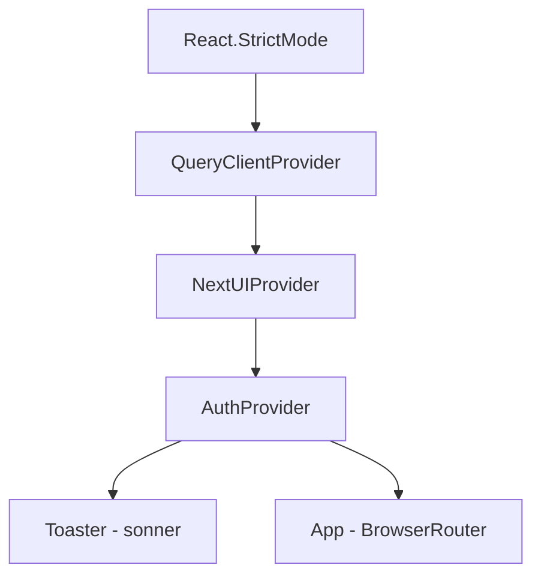
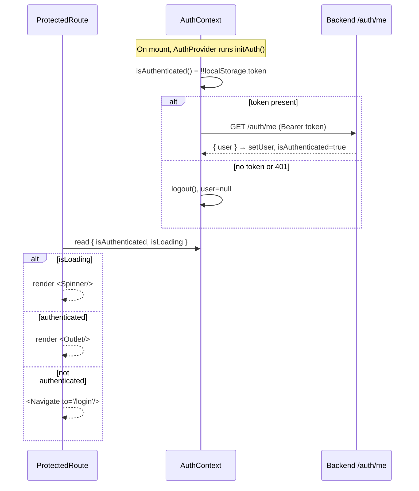
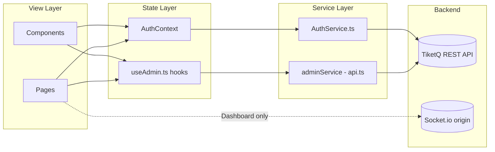

# 01 — Architecture

## 1. Technology Stack

Verified from `package.json`, `vite.config.ts`, `tsconfig*.json`, and `src/main.tsx`.

| Concern | Technology | Version (from `package.json`) | Notes |
|---------|-----------|-------------------------------|-------|
| Build tool / dev server | Vite | `^8.0.1` | Config in `vite.config.ts`. |
| UI runtime | React | `^19.2.4` | React 19; app wrapped in `React.StrictMode`. |
| Language | TypeScript | `~5.9.3` | Project-references build (`tsc -b`). |
| Component library | NextUI v2 (`@nextui-org/react`) | `^2.6.11` | Also `@nextui-org/system` `^2.4.6`, `@nextui-org/theme` `^2.4.5`. **No `antd` dependency exists.** |
| Styling | Tailwind CSS v4 | `^4.2.2` | Wired via the `@tailwindcss/vite` plugin in `vite.config.ts`. |
| Server state / data fetching | React Query (`@tanstack/react-query`) | `^5.95.2` | Single `QueryClient` in `src/main.tsx`. |
| HTTP client | Axios | `^1.14.0` | Single instance in `src/services/api.ts`. |
| Charts | Recharts | `^3.8.1` | Area/Bar on Dashboard, Bar/Pie on Analytics. |
| Routing | React Router (`react-router-dom`) | `^7.13.2` | `BrowserRouter` in `src/App.tsx`. |
| Real-time | `socket.io-client` | `^4.8.3` | Used only by the Dashboard for `visitors_update`. |
| Toasts | `sonner` | `^2.0.7` | `<Toaster>` mounted in `src/main.tsx` (dark theme, top-right). |
| Confirmation dialogs | `sweetalert2` + `sweetalert2-react-content` | `^11.26.24` / `^5.1.2` | Wrapped in `src/utils/swal.ts`. |
| Rich text | `react-quill-new` | `^3.8.3` | Car description editor only. |
| Icons | `lucide-react` | `^1.7.0` | Used throughout. |
| Class utilities | `clsx` + `tailwind-merge` | `^2.1.1` / `^3.5.0` | Combined as `cn()` in `src/lib/utils.ts`. |
| Animation | `framer-motion` | `^12.38.0` | Transitive/peer usage via NextUI. |

> Note: there is **no test runner** configured in `package.json`. Scripts are limited to `dev`, `build`, `lint`, `preview`.

## 2. Directory Map

```
tiket-admin/
├── index.html                     # SPA shell, mounts #root, loads /src/main.tsx
├── vite.config.ts                 # react() + tailwindcss() plugins
├── .env                           # VITE_API_URL (see 06-DEPLOYMENT.md)
├── src/
│   ├── main.tsx                   # Providers: QueryClient → NextUI → Auth → Toaster → App
│   ├── App.tsx                    # BrowserRouter + route table
│   ├── index.css / App.css        # Tailwind entry + global styles
│   ├── context/
│   │   └── AuthContext.tsx        # AuthProvider, useAuth(), init-auth effect
│   ├── services/
│   │   ├── api.ts                 # Axios instance + adminService (all admin endpoints)
│   │   └── AuthService.ts         # login / logout / getMe / token helpers
│   ├── hooks/
│   │   └── useAdmin.ts            # React Query hooks + all shared TypeScript interfaces
│   ├── components/
│   │   ├── Auth/ProtectedRoute.tsx
│   │   ├── Layout/RootLayout.tsx  # Sidebar + <Outlet/> shell
│   │   ├── Layout/Sidebar.tsx     # Nav menu, user block, logout
│   │   ├── SystemHealth.tsx       # 4-card health strip (Dashboard)
│   │   └── UpcomingSchedules/index.tsx
│   ├── pages/
│   │   ├── Dashboard/index.tsx    # route "/"
│   │   ├── Transactions/index.tsx # route "/transactions"
│   │   ├── CarRental/index.tsx    # route "/car-rental"
│   │   ├── Analytics/index.tsx    # route "/analytics"
│   │   ├── Users/index.tsx        # route "/users"
│   │   ├── ServerManager/index.tsx# route "/server"
│   │   ├── Logs/index.tsx         # route "/logs"
│   │   └── Login/index.tsx        # route "/login"
│   ├── lib/utils.ts               # cn() helper
│   └── utils/swal.ts              # confirmDelete / confirmAction dialogs
```

Convention: each page is a folder `pages/<Name>/index.tsx`. Shared cross-page UI lives in `components/`. Data-fetch hooks and shared types both live in `hooks/useAdmin.ts`.

## 3. Provider Composition

From `src/main.tsx`, providers nest outermost-to-innermost:



`QueryClient` is a bare `new QueryClient()` with no custom default options. Cross-cutting fetch behaviour (auth header injection, error toasts) lives in the Axios interceptors, not in React Query config — see `03-API-SERVICE.md`.

## 4. Routing Structure

Defined in `src/App.tsx`:

```
/login                     → LoginPage                     (public)
<ProtectedRoute>
  /                        → RootLayout
    index                  → DashboardPage
    /transactions          → TransactionsPage
    /car-rental            → CarRentalPage
    /analytics             → AnalyticsPage
    /users                 → UsersPage
    /server                → ServerManager
    /logs                  → LogsPage
    *                      → <Navigate to="/" replace/>    (catch-all)
</ProtectedRoute>
```

- `/login` is the only route outside the guard.
- Every other route is nested under a single `<Route element={<ProtectedRoute/>}>`, then under `RootLayout` which renders the `Sidebar` plus a React Router `<Outlet/>`.
- The catch-all `*` inside the layout redirects unknown paths back to `/`.
- The `Sidebar` (`src/components/Layout/Sidebar.tsx`) exposes seven nav entries matching the seven authenticated routes; its labels ("Overview", "Server Manager", "System Logs", …) are the user-facing names.

## 5. ProtectedRoute Pattern

`src/components/Auth/ProtectedRoute.tsx`:



Key facts:

- `AuthProvider` (`src/context/AuthContext.tsx`) runs `initAuth()` once on mount: if a token exists it calls `AuthService.getMe()`; on failure it clears the token and user. `isLoading` gates the first render so the guard shows a spinner rather than bouncing to `/login` prematurely.
- `ProtectedRoute` renders `<Outlet/>` when authenticated, a full-screen `<Spinner/>` while loading, and redirects to `/login` otherwise.
- Guarding is binary (token resolves to a user or not); there is no per-route role check on the client.

## 6. Component / Data-Flow



- Pages/components read server state through React Query hooks in `useAdmin.ts` (`useTransactions`, `useStats`, `useHealth`, `useCars`, `useSchedules`, …) or, where a page owns its own query, directly through `adminService` (e.g. `UsersPage`, `ServerManager`, `LogsPage`).
- Mutations (`useTransactionMutation`, `useCarMutation`, per-page `useMutation`) call `adminService` and invalidate the relevant query key on success.
- Auth state flows through `AuthContext`, which delegates to `AuthService`.
- The only direct Socket.io usage is the Dashboard's live-visitor counter; there is no polling `refetchInterval` anywhere except `useHealth` (5 s), and the Server Manager / Logs pages use their own `setInterval`.
