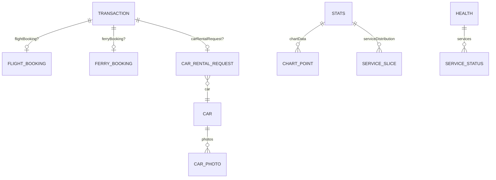

# 02 — Data Model

All shared types consumed by the dashboard are declared in `src/hooks/useAdmin.ts` (business entities) and `src/services/AuthService.ts` (auth user). The Server Manager declares its own local interfaces inline in `src/pages/ServerManager/index.tsx`. This document reproduces them exactly as coded and notes their semantics.

These are TypeScript **client-side** shapes describing what the backend returns after the service layer unwraps the `AppResponse<T>` envelope (`{ message, data }`, defined in `src/services/api.ts`). They are structural contracts, not validated at runtime.

---

## 1. Transaction

Source: `src/hooks/useAdmin.ts`.

```ts
interface Transaction {
  id: number;
  serviceType: string;          // "FLIGHT" | "FERRY" | "CAR_RENTAL" in practice, typed as string
  bookingCode?: string;         // optional; UI falls back to `#${id}`
  email: string;
  totalSales: number;           // numeric amount (rendered as "Rp {toLocaleString('id-ID')}")
  status: string;               // "PAID" | "PENDING" | "CANCELLED" | "REFUNDED" (see status map)
  createdAt: string;            // ISO date string
  flightBooking?: {
    id: number;
    name?: string;
    origin?: string;
    destination?: string;
    departureDate?: string;
    passengers?: any[];
    ticketIssued?: boolean;
  };
  ferryBooking?: {
    id: number;
    mobile_number?: string;
    origin?: { name: string };
    destination?: { name: string };
    departureDate?: string;
    passengers?: any[];
    ticketIssued?: boolean;
  };
  carRentalRequest?: {
    id: number;
    fullName?: string;
    date?: string;
    rentalDays?: number;
    car?: { name: string; type: string };
  };
}
```

Notable, verified facts:

- `totalSales` is a **`number`**, not a string. It is coerced through `Number(...)` before display but is already numeric.
- `serviceType` is typed as `string`. The UI branches on the literals `"FLIGHT"`, `"FERRY"`, `"CAR_RENTAL"` (`src/pages/Transactions/index.tsx` `QuickViewModal`, and `isTicketIssued`).
- `bookings` sub-objects are **optional and mutually exclusive by service type**: exactly one of `flightBooking` / `ferryBooking` / `carRentalRequest` is expected to be populated.
- There is **no `payment_status` field**. Payment/booking state is carried solely by `status`.
- `passengers` is typed `any[]`; the Quick View reads `firstName`, `lastName`, `title` off each element.
- `ticketIssued` (on flight/ferry) is the flag that disables cancel/refund; car rentals are exempt (`isTicketIssued`).

### Status values

The Transactions status color map (`src/pages/Transactions/index.tsx`) recognises: `success`, `pending`, `failed` (lowercase legacy) and `PAID`, `PENDING`, `CANCELLED`, `REFUNDED`. `statusLabel()` renders `"PENDING"` as the friendlier label **"Booked"**.

---

## 2. Stats

Source: `src/hooks/useAdmin.ts`. Consumed by the Dashboard and Analytics pages.

```ts
interface Stats {
  totalTransactions: number;
  successfulTransactions: number;
  totalRevenue: number;
  activeCars: number;
  growth: string;                                   // e.g. "+12%" — displayed verbatim
  chartData: { name: string; total: number }[];     // monthly series for area/bar charts
  serviceDistribution: { name: string; value: number; color: string }[]; // pie slices w/ colors
}
```

- `chartData` drives both the Dashboard revenue area chart and volume bar chart, and the Analytics revenue bar chart (all keyed on `name` / `total`).
- `serviceDistribution` drives the Analytics pie chart; each slice carries its own `color`.
- `successfulTransactions / totalTransactions` is used on the Dashboard to compute a "success rate" string.

---

## 3. Health

Source: `src/hooks/useAdmin.ts`. Consumed by `SystemHealth` (Dashboard strip) and the Analytics status banner.

```ts
interface Health {
  status: string;                                   // "Online" is the healthy sentinel
  services: { name: string; status: string; latency: string }[]; // "Healthy" per-service sentinel
  system: {
    cpu: string;                                    // e.g. "0.42"
    memory: string;                                 // human string, e.g. "512MB / 2GB"
    uptime: string;
    cpuPercent?: number;                            // optional numeric for progress bar
    memPercent?: number;                            // optional numeric for progress bar
  };
}
```

- `useHealth()` polls every 5000 ms (`refetchInterval: 5000`) — the only React Query polling in the app.
- `SystemHealth.tsx` falls back to `parseInt(system.cpu)` when `cpuPercent` is absent, and treats `memPercent` as `0` when absent.
- `status === "Online"` and per-service `status === "Healthy"` are the green/healthy sentinels.

> This `Health` shape (returned by `GET /admin/health`) is distinct from the richer `ServerHealth` shape used by the Server Manager's `GET /admin/server/health` (see §7).

---

## 4. Car

Source: `src/hooks/useAdmin.ts`. Consumed by the Car Rental page.

```ts
interface Car {
  id: number;
  name: string;
  type: string;                 // one of carTypes list in CarRental page
  rows: number;                 // number of seat rows
  pricePerDay: number;          // amount; label says "per {pricingDuration}"
  pricingDuration?: string;     // "Hari" | "12 Jam" | "Minggu" | "Bulan"
  available: boolean;
  description?: string;         // rich HTML from ReactQuill
  transmission?: string;        // "Automatic" | "Manual"
  features?: string[];          // e.g. "AC Dingin", "Termasuk BBM"
  photos?: { id: number; url: string; isPrimary: boolean }[];
}
```

- `pricePerDay` is a number despite its name; the label describes it as price per `pricingDuration`.
- `photos` is a gallery; the first entry is used as the thumbnail, and `isPrimary` flags the primary image.
- Enumerations for `type`, `pricingDuration`, `transmission`, and `features` are hardcoded in `src/pages/CarRental/index.tsx` (`carTypes`, `durationTypes`, `CAR_FEATURES`).

---

## 5. Schedule

Source: `src/hooks/useAdmin.ts`. Consumed by `UpcomingSchedules`.

```ts
interface Schedule {
  id: string;                       // format "<something>-<code>-..."; UI reads id.split('-')[1]
  type: "FLIGHT" | "FERRY" | "CAR"; // note: "CAR", not "CAR_RENTAL"
  productName: string;
  date: string;                     // ISO date string
  customerName: string;
  detail: string;                   // headline shown in the card
}
```

- `type` is a strict union here and uses `"CAR"` (contrast with `Transaction.serviceType` which uses `"CAR_RENTAL"`).
- `UpcomingSchedules` partitions the array into three columns by `type`.

---

## 6. User (auth)

Source: `src/services/AuthService.ts`. Consumed by the Users page and `AuthContext`.

```ts
interface User {
  id: number;
  username: string;
  isAdmin: boolean;
}

interface AuthResponse {
  token: string;
  message: string;
}
```

- `getUsers()` (`adminService`) returns `User[]`; the Users page renders `createdAt` defensively via a `@ts-expect-error` cast because the field is not part of the declared `User` type but may exist at runtime.
- `isAdmin` is displayed (role chip, stat counts) but does not gate client routing.

---

## 7. Server Manager local types

Source: `src/pages/ServerManager/index.tsx` (declared inline, not exported).

```ts
interface ServerFile {
  name: string;
  path: string;
  isDir: boolean;
  size: number;
  modifiedAt: string;
  hasPackageJson: boolean;      // marks a directory as a Node.js project
}

interface PM2Process {
  pm_id: number;
  name: string;
  pm2_env: { status: string };  // "online" is the healthy sentinel
  monit: { memory: number; cpu: number }; // memory in bytes, cpu in %
  pid: number;
}

interface ServerHealth {
  cpu: { load: string; cores: number };
  memory: { total: string; used: string; free: string; percent: string };
  disk: { total: string; used: string; available: string; percent: string };
  uptime: string;
}
```

- `PM2Process.monit.memory` is in bytes; the UI divides by `1024/1024` to show MB.
- `ServerHealth` fields are strings parsed with `parseFloat` / `parseInt` for the progress bars.

---

## 8. Entity Relationships



A `Transaction` links to at most one of the three booking sub-entities. A `CAR_RENTAL_REQUEST` references one `Car`, and a `Car` owns many `CAR_PHOTO`s. These relationships are inferred from the client shapes only; the authoritative schema lives in the backend (`tiketq-bosbiller`).
