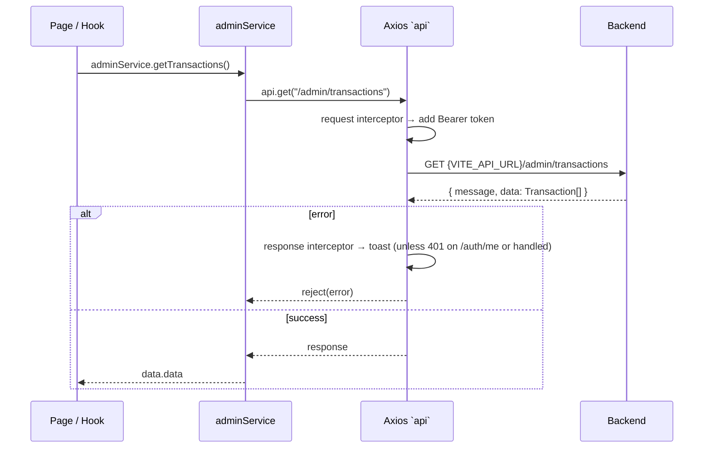

# 03 — API Service Layer

All backend communication is centralised in two files:

- `src/services/api.ts` — the shared Axios instance and the `adminService` object (every admin/business/infra endpoint).
- `src/services/AuthService.ts` — authentication calls, which use the **bare `axios`** module (not the shared instance) and manage the token.

---

## 1. The Axios Instance

From `src/services/api.ts`:

```ts
const api = axios.create({
  baseURL: import.meta.env.VITE_API_URL,
});
```

- **Base URL** is read from the `VITE_API_URL` environment variable at build time (see `06-DEPLOYMENT.md`). Every path below is relative to it.
- The response envelope is `AppResponse<T> = { message: string; data: T }`. Service methods return the unwrapped `data.data` (except a few server-management methods that return `data` directly — noted below).

### 1.1 Request interceptor — JWT injection

```ts
api.interceptors.request.use((config) => {
  const token = localStorage.getItem("token");
  if (token) config.headers.Authorization = `Bearer ${token}`;
  return config;
});
```

Every request carries `Authorization: Bearer <token>` when a token is present in `localStorage`. There is no refresh logic; the token is used verbatim until logout clears it.

### 1.2 Response interceptor — global error handling

```ts
api.interceptors.response.use(
  (response) => response,
  (error) => {
    const message = error.response?.data?.error
      || error.response?.data?.message
      || "Something went wrong";
    const isCheckAuth = error.config.url === "/auth/me";

    if (error.response?.status >= 500) {
      toast.error("Server Error", { description: "The server encountered an internal error..." });
    } else if (error.response?.status !== 401 || !isCheckAuth) {
      toast.error("Error", { description: message });
    }
    return Promise.reject(error);
  }
);
```

Behaviour, verified:

- **5xx** → generic "Server Error" toast.
- **Any error except a 401 on `/auth/me`** → an "Error" toast carrying the backend's `error`/`message`.
- **401 on `/auth/me`** → **silently swallowed** (no toast). This is the unauthenticated first-page-load case handled by `AuthContext.initAuth()`.
- The rejected promise still propagates, so callers can react; most pages rely on the interceptor's toast and catch-and-ignore (e.g. Transactions cancel/refund handlers).

> Note: `AuthService.getMe()` uses the **bare `axios`** with a manually attached header, and its request URL is the absolute `${API_URL}/auth/me`. The interceptor's `isCheckAuth` check compares `error.config.url === "/auth/me"`, which matches requests made through the `api` instance (relative URL). The swallow therefore applies to interceptor-observed 401s whose config url is exactly `/auth/me`.

---

## 2. AuthService (`src/services/AuthService.ts`)

Uses the bare `axios` module and `import.meta.env.VITE_API_URL`.

| Method | HTTP call | Effect / return |
|--------|-----------|-----------------|
| `login(username, password)` | `POST {API_URL}/auth/admin-login` `{ username, password }` | On success stores `response.data.token` in `localStorage.token`; returns `AuthResponse`. |
| `logout()` | — (local) | `localStorage.removeItem("token")`. |
| `getCurrentToken()` | — (local) | Returns `localStorage.token`. |
| `isAuthenticated()` | — (local) | Returns `!!localStorage.token`. |
| `getMe()` | `GET {API_URL}/auth/me` (Bearer header set manually) | Returns `response.data.user` (`User`). |

---

## 3. adminService Method Map

All methods below are on the `adminService` object in `src/services/api.ts` and go through the shared `api` instance (JWT + error interceptors apply). Paths are relative to `VITE_API_URL`.

### 3.1 Transactions

| Method | HTTP | Path | Returns |
|--------|------|------|---------|
| `getTransactions()` | GET | `/admin/transactions` | `Transaction[]` |
| `cancelTransaction(id)` | PATCH | `/admin/transactions/${id}/cancel` | `Transaction` |
| `refundTransaction(id)` | PATCH | `/admin/transactions/${id}/refund` | `Transaction` |

### 3.2 Stats / monitoring

| Method | HTTP | Path | Returns |
|--------|------|------|---------|
| `getStats()` | GET | `/admin/stats` | `Stats` |
| `getHealth()` | GET | `/admin/health` | `Health` |
| `getUpcomingSchedules()` | GET | `/admin/upcoming-schedules` | `Schedule[]` |
| `getLogs()` | GET | `/admin/logs` | `string` (raw log text) |

### 3.3 User management

| Method | HTTP | Path | Body | Returns |
|--------|------|------|------|---------|
| `getUsers()` | GET | `/admin/users` | — | `User[]` |
| `registerUser(userData)` | POST | `/admin/users/register` | `Record<string,unknown>` (`{ username, password }`) | `User` |
| `updateUser(id, userData)` | PUT | `/admin/users/${id}` | `{ username, password? }` | `User` |
| `deleteUser(id)` | DELETE | `/admin/users/${id}` | — | `void` |

### 3.4 Car rental

| Method | HTTP | Path | Body | Returns |
|--------|------|------|------|---------|
| `getCars()` | GET | `/car-rental/cars` | — | `Car[]` (returns `data.data`) |
| `createCar(carData)` | POST | `/car-rental/cars` | `Partial<Car>` | created car |
| `updateCar(id, carData)` | PUT | `/car-rental/cars/${id}` | `Partial<Car>` | updated car |
| `deleteCar(id)` | DELETE | `/car-rental/cars/${id}` | — | result |
| `uploadPhotos(carId, photos)` | POST | `/car-rental/cars/${carId}/photos` | `multipart/form-data` (`photos` field, repeated) | result |
| `deletePhoto(photoId)` | DELETE | `/car-rental/photos/${photoId}` | — | result |
| `deletePhotosBulk(photoIds)` | POST | `/car-rental/photos/bulk-delete` | `{ ids: number[] }` | result |

> Car endpoints live under `/car-rental`, not `/admin`.

### 3.5 Server / infrastructure management

| Method | HTTP | Path | Body / query | Returns |
|--------|------|------|--------------|---------|
| `getServerFiles(path?)` | GET | `/admin/server/files?path=${path\|""}` | — | `ServerFile[]` |
| `getFileContent(path)` | GET | `/admin/server/file?path=${path}` | — | file content (string) |
| `saveServerFile(path, content)` | POST | `/admin/server/file/save` | `{ path, content }` | full `data` (not unwrapped) |
| `moveServerFile(oldPath, newPath)` | POST | `/admin/server/file/move` | `{ oldPath, newPath }` | full `data` |
| `deleteServerFile(path)` | DELETE | `/admin/server/file?path=${path}` | — | full `data` |
| `getPm2Processes()` | GET | `/admin/server/pm2` | — | `PM2Process[]` |
| `getServerHealth()` | GET | `/admin/server/health` | — | `ServerHealth` |
| `executeServerCommand(action, id?, customPath?, extra?)` | POST | `/admin/server/execute` | `{ action, id, customPath, ...extra }` | `{ stdout, stderr, exitCode }` |

`executeServerCommand` is the single dispatch point for privileged host operations. The `action` string is set by the Server Manager UI and includes: `pm2-start`, `pm2-restart`, `pm2-delete`, `git-clone` (with `extra.url`), `git-pull`, `git-restore`, `npm-install`, `npm-build`, `prisma-generate`, `prisma-migrate`, and `raw` (with `extra.command` — an arbitrary shell command). See `04-FEATURES.md §6` and `05-AUTH-AND-SECURITY.md`.

---

## 4. Notable Absences (verified)

- **No receipt / resend endpoint.** There is no `sendReceipt`, `resendReceipt`, or equivalent method anywhere in `adminService`. Any historical "Send Receipt" UI has been removed.
- **No pagination / query params** on `getTransactions`, `getUsers`, or `getCars` — the client fetches the full list and filters/searches in memory.
- **No websocket in the service layer.** The only Socket.io usage is inline in `src/pages/Dashboard/index.tsx`.

---

## 5. Call-Path Diagram


