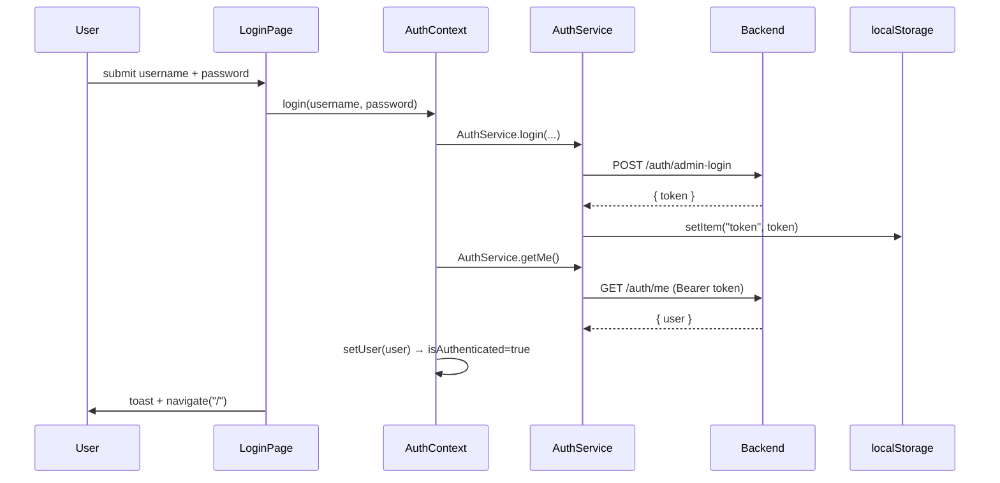
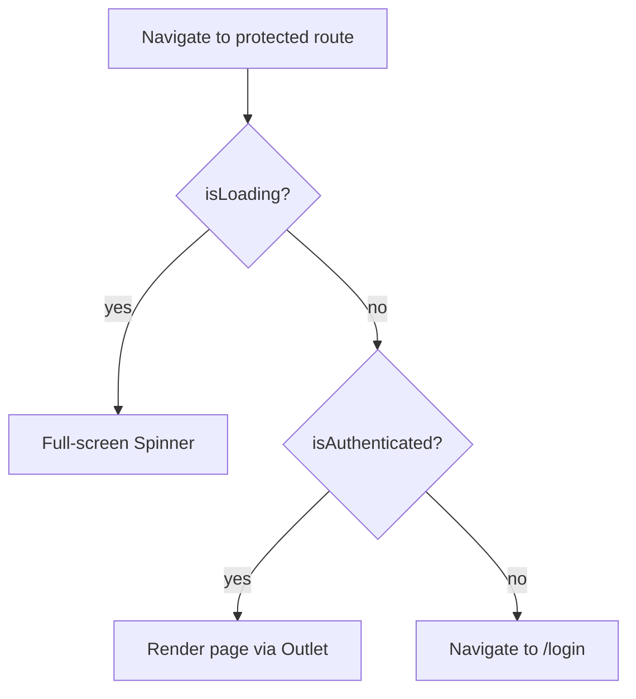

# 05 — Authentication & Security

Grounded in `src/services/AuthService.ts`, `src/context/AuthContext.tsx`, `src/components/Auth/ProtectedRoute.tsx`, `src/services/api.ts`, `src/pages/Login/index.tsx`, and `src/pages/ServerManager/index.tsx`.

---

## 1. Authentication Flow

- **Login** — `LoginPage` calls `useAuth().login()`, which calls `AuthService.login()` (`POST /auth/admin-login`). The returned `token` is stored in `localStorage` under the key `token`. `login()` then immediately calls `getMe()` to hydrate the user object.
- **Session restore** — on app mount, `AuthProvider.initAuth()` checks for a token; if present it calls `getMe()` and, on failure, clears the token and user. `isLoading` gates rendering so the guard does not flash to `/login` during this check.
- **Token usage** — the Axios request interceptor (`src/services/api.ts`) attaches `Authorization: Bearer <token>` to every request made through the shared `api` instance.
- **Logout** — `AuthService.logout()` removes the token from `localStorage`; `AuthContext.logout()` also clears the user and shows a toast. The Sidebar's Sign Out then navigates to `/login`.

## 2. Route Guarding

`ProtectedRoute` wraps every non-login route (`src/App.tsx`). `isAuthenticated` is simply `!!user`, and `user` is non-null only after a successful `getMe()`. There is no per-route authorization: any authenticated user reaches every page, including the Server Manager.

## 3. Security Posture (factual)

### 3.1 Server-side auth is the real boundary

The dashboard calls `/api/admin/*` endpoints, which are **auth-guarded server-side** by the backend. The client's token-presence check is a UX gate, not a security boundary — the backend must (and is expected to) reject unauthenticated or unauthorized requests regardless of what the client renders.

### 3.2 RBAC is token-presence only on the client

- The client models roles with `User.isAdmin` but does **not** branch route access on it (`ProtectedRoute` checks only authentication). `isAdmin` is used purely for display (role chips, counts on the Users page).
- Consequently, any principal the backend accepts a token for, and admits to `/auth/me`, gains the full dashboard UI on the client. Effective authorization must be enforced by the backend per endpoint.

### 3.3 Token storage

- The JWT is stored in `localStorage`, which is readable by any JavaScript running on the origin and is therefore susceptible to XSS token theft. There is no refresh-token rotation and no client-side expiry handling beyond the backend rejecting an expired token (which would surface as an error toast, or a swallowed 401 specifically on `/auth/me`).

### 3.4 Server Manager exposes infrastructure operations

The Server Manager (`/server`, `src/pages/ServerManager/index.tsx`) is the most sensitive surface. Through `adminService.executeServerCommand` and the file endpoints it can, on the backend host:

- Start / restart / delete PM2 processes.
- Browse, read, edit/overwrite, move/rename, and delete files.
- Run `git clone / pull / restore`, `npm install / build`, `prisma generate / migrate`.
- Execute **arbitrary shell commands** via the `raw` action ("Direct Shell Link" input).

These capabilities are equivalent to shell access to the production host. Because the client applies no role check beyond authentication, the backend's authorization on `/admin/server/*` and `/admin/server/execute` is the sole control preventing any authenticated dashboard user from performing destructive infrastructure actions. This should be treated as a privileged, tightly-scoped capability and audited accordingly.

## 4. Observations (non-prescriptive)

The following are factual gaps relative to common practice, stated for the record; remediation is out of scope for this SDD:

- No client-side role separation between "operator" and "infrastructure admin"; the Server Manager is reachable by every authenticated user.
- Token in `localStorage` rather than an `HttpOnly` cookie.
- The `raw` shell command action provides unconstrained execution surface; its safety depends entirely on backend authorization and validation.
