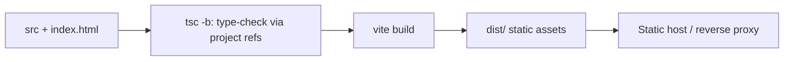

# 06 — Build & Deployment

Grounded in `package.json`, `vite.config.ts`, `index.html`, `.env`, and `tsconfig*.json`.

---

## 1. Build Model

`tiket-admin` is a **static single-page application**. There is no server component in this project; the build emits static assets that are served by any static file host / reverse proxy.

### Scripts (`package.json`)

| Script | Command | Purpose |
|--------|---------|---------|
| `npm run dev` | `vite` | Local dev server with HMR. |
| `npm run build` | `tsc -b && vite build` | Type-check (project references) then produce the production bundle in `dist/`. |
| `npm run preview` | `vite preview` | Serve the built `dist/` locally to verify the production bundle. |
| `npm run lint` | `eslint .` | Lint the source. |

### Build pipeline



- `tsc -b` runs first and will fail the build on type errors (project-reference config: `tsconfig.json` → `tsconfig.app.json` + `tsconfig.node.json`).
- `vite build` (Vite `^8`) bundles React 19 + Tailwind v4 (via the `@tailwindcss/vite` plugin in `vite.config.ts`) and outputs to the default `dist/` directory.
- The entry HTML is `index.html`, which mounts `#root` and loads `/src/main.tsx` as a module.

## 2. Configuration — Environment Variables

The application reads exactly **one** environment variable, and only via Vite's `import.meta.env`:

| Variable | Read in | Meaning |
|----------|---------|---------|
| `VITE_API_URL` | `src/services/api.ts` (Axios `baseURL`), `src/services/AuthService.ts` (`API_URL`), `src/pages/Dashboard/index.tsx` (Socket.io origin) | Base URL of the TiketQ backend REST API. |

Facts and caveats:

- The variable **must** carry the `VITE_` prefix to be exposed to client code by Vite. No other prefix is read.
- `VITE_API_URL` is baked into the bundle **at build time** (it is a compile-time substitution, not a runtime lookup). Changing the backend target requires a rebuild.
- The repository's committed `.env` sets `VITE_API_URL=https://api.tiketq.com/api` — i.e. the **production** backend. For local or destructive testing this must be redirected (e.g. to `http://localhost:3000/api`) before building/running, otherwise the dashboard operates against production data and infrastructure.
- Dashboard Socket.io derives its connection origin from `VITE_API_URL` by stripping the path (`new URL(apiUrl).origin`), with a production fallback to `https://api.tiketq.com` when the bundled URL is localhost but the browser is on a non-local hostname (`src/pages/Dashboard/index.tsx`).

### Example `.env` for local development

```env
VITE_API_URL="http://localhost:3000/api"
```

## 3. Serving the Build

- Output: the static `dist/` directory (default Vite output).
- Because routing uses `BrowserRouter` (HTML5 history), the static host **must** be configured with an SPA fallback (rewrite unknown paths to `/index.html`) so that deep links such as `/transactions` resolve to the app rather than a 404. This is a standard SPA hosting requirement; verify it in whatever reverse proxy / static host is used.
- No environment-specific runtime config is loaded by the client; all configuration is compile-time. Multiple environments therefore require separate builds (one per `VITE_API_URL`).

## 4. Dev / Preview Workflow

```bash
# install
npm install

# local development (HMR) — remember to point VITE_API_URL locally first
npm run dev

# production build
npm run build            # → dist/

# verify the production bundle locally
npm run preview
```

## 5. Deliverable Summary

| Artifact | Location |
|----------|----------|
| Production bundle | `dist/` |
| SPA entry | `dist/index.html` |
| Required env at build | `VITE_API_URL` |
| Hosting requirement | Static host with SPA history fallback to `index.html` |
